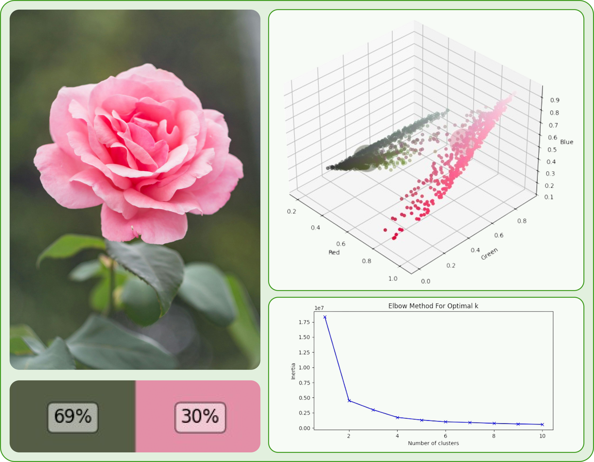

# Python Color Prediction
This project aims to predict the color of an image using Python. It utilizes machine learning algorithms, specifically k-means clustering, to analyze the pixel values of an image and predict the dominant color.

K-means clustering is a popular unsupervised learning algorithm used for clustering data points into groups. In the context of color prediction, k-means clustering is used to group similar pixel values together, allowing us to identify the dominant color in an image. The algorithm works by iteratively assigning each pixel to the cluster with the closest centroid, and then updating the centroids based on the new assignments. This process continues until the centroids no longer change significantly. By applying k-means clustering to the pixel values of an image, we can identify the cluster centroids, which represent the dominant colors. To use this project, simply follow the installation instructions below. 

## Installation TODO

To get started with the Python color prediction function, simply install the package using pip and follow the provided documentation for configuration and usage instructions: `pip install uugai_python_color_prediction`
To import the function into your own python file, use: `from uugai_python_color_prediction import find_main_colors`

## Usage
The find_main_colors function is used to predict the dominant colors of an image. It takes several parameters:

* image: The input image for color prediction, using `cv2.imread(IMAGE_PATH)`.
* min_clusters and max_clusters: The minimum and maximum number of clusters to use for k-means clustering.
* downsample_factor: A factor used to downsample the image before color prediction. Default value is 0.95.
* increase_elbow: An optional parameter to increase/decrease the elbow point in the k-means clustering algorithm. Default value is 0.
* verbose: A boolean value indicating whether to print verbose output during color prediction. Default value is False.
* plot: A boolean value indicating whether to plot the color prediction results. Default value is False.

To use the find_main_colors function, simply pass the required parameters and call the function. The function will return the predicted dominant colors of the image, optimal number of centroids ± the elbow offset and the percentages of pixels belonging to that centroid.

## Usage example
```Python
IMAGE_PATH = 'python_color_prediction/data/flowers.jpeg'

# Read the image
image = cv2.imread(IMAGE_PATH)

# Call the elbow_method function
optimal_centroids, optimal_k, optimal_percentages = find_main_colors(image, min_clusters=1, max_clusters=10, downsample_factor=0.95, increase_elbow=0, verbose=True, plot=True)
```

This would result in the following output, with `verbose = True`:

```
Calculating for k =  1
Calculating for k =  2
Calculating for k =  3
Calculating for k =  4
Calculating for k =  5
Calculating for k =  6
Calculating for k =  7
Calculating for k =  8
Calculating for k =  9
Calculating for k =  10
The optimal number of clusters is:  3
The colors associated with each cluster are: 
 [[ 54  35  24]
 [125  34 209]
 [200 138  98]]
The percentage of points in each cluster are:  [43 29 27]
```

The plotting parameter enables the creation of a KMeans-clustering inertia plot, which is used for the elbow method. Additionally, it generates a 3D scatter plot of the pixel values, displaying the cluster centroids in their corresponding colors. Finally, it includes a small plot showing the centroid colors along with their respective percentages.

<div style="text-align:center;">
    
</div>