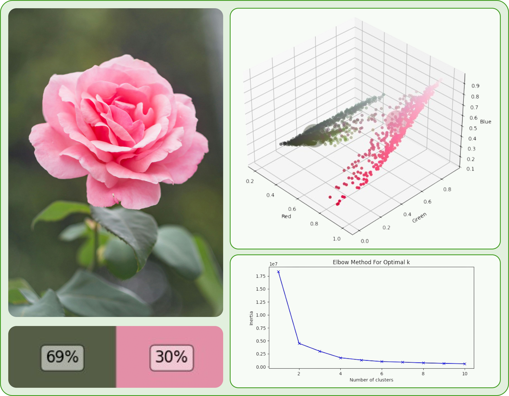

# Python Color Prediction
This project aims to predict the color of an image using Python. It utilizes machine learning algorithms, specifically k-means clustering, to analyze the pixel values of an image and predict the dominant color.

K-means clustering is a popular unsupervised learning algorithm used for clustering data points into groups. In the context of color prediction, k-means clustering is used to group similar pixel values together, allowing us to identify the dominant color in an image. The algorithm works by iteratively assigning each pixel to the cluster with the closest centroid, and then updating the centroids based on the new assignments. This process continues until the centroids no longer change significantly. By applying k-means clustering to the pixel values of an image, we can identify the cluster centroids, which represent the dominant colors. To use this project, simply follow the installation instructions below. 

## Installation

To get started with the Python color prediction function, simply install the package using pip and follow the provided documentation for configuration and usage instructions.
Thereafter, import the function into your own python file. The package can be found on [PyPi](https://pypi.org/project/uugai-python-color-prediction/).

* installation using pip: `pip install uugai_python_color_prediction`
* python import: `from uugai_python_color_prediction.ColorPrediction import ColorPrediction`

### Uploading package to PyPi

This can be easily done in just a few terminal commands. First edit the setup.py file to alter the version name. Thereafter execute following commands:

```
python setup.py sdist bdist_wheel
cd dist
twine upload *
```

## Usage
The find_main_colors function is used to predict the dominant colors of an image. It takes several parameters:

* image: The input image for color prediction, using `cv2.imread(IMAGE_PATH)`.
* coding: The colorsystem used, supported is BGR (standard), RGB, BGRA and RGBA.
* min_clusters and max_clusters: The minimum and maximum number of clusters to use for k-means clustering.
* downsample_factor: A factor used to downsample the image before color prediction. Default value is 0.
* increase_elbow: An optional parameter to increase/decrease the elbow point in the k-means clustering algorithm. Default value is 0.
* verbose: A boolean value indicating whether to print verbose output during color prediction. Default value is False.
* plot: A boolean value indicating whether to plot the color prediction results. Default value is False.

To use the find_main_colors function, simply pass the required parameters and call the function. The function will return all the kmeans cluster data and optimal k-value.
The kmeans-data looks something like this:
```
{
1: 
    {'inertias': 18358588.71525097, 
    'centroids': array([[128, 108, 100]]), 
    'percentages': array([100.])}, 
2: 
    {'inertias': 4514844.78507838, 
    'centroids': array([[ 85,  93,  71], [227, 143, 167]]), 
    'percentages': array([69.8, 30.2])}
...
}
```

### Alpha channel additonal details
If RGBA or BGRA is used, pixels with full transparancy are removed for clustering. This allows the color detection to work with for example masked images from segmentation models. For pixels with alpha values different from 0, the color channels are used for clustering in 3D space. This means pixels with the same color but altering alpha values are classified as identical.

### No elbow point found
If no elbow point can be found, the function will return an optimal cluster value of None.

## Usage example
```Python
from uugai_python_color_prediction.ColorPrediction import ColorPrediction

IMAGE_PATH = 'python_color_prediction/data/flowers.jpeg'

# Read the image
img = cv2.imread(IMAGE_PATH, cv2.IMREAD_UNCHANGED)

# Call the elbow_method function
optimal_k, kmeans_data = ColorPrediction.find_main_colors(
    image = img,
    coding = 'RGB'
    min_clusters=1,
    max_clusters=8, 
    downsample_factor=0.98, 
    increase_elbow=0, 
    verbose=True, 
    plot=True)
```

This would result in the following output, with `verbose = True`:

```
Calculating KMeans for k=1...
Calculating KMeans for k=2...
Calculating KMeans for k=3...
Calculating KMeans for k=4...
Calculating KMeans for k=5...
Calculating KMeans for k=6...
Calculating KMeans for k=7...
Calculating KMeans for k=8...

The optimal number of clusters is: 2
Color: [227 143 167], Percentage: 30.2%
Color: [85 93 71], Percentage: 69.8%
```

The plotting parameter enables the creation of a KMeans-clustering inertia plot, which is used for the elbow method. Additionally, it generates a 3D scatter plot of the pixel values, displaying the cluster centroids in their corresponding colors. Finally, it includes a small plot showing the centroid colors along with their respective percentages.

<div style="text-align:center;">
    
</div>